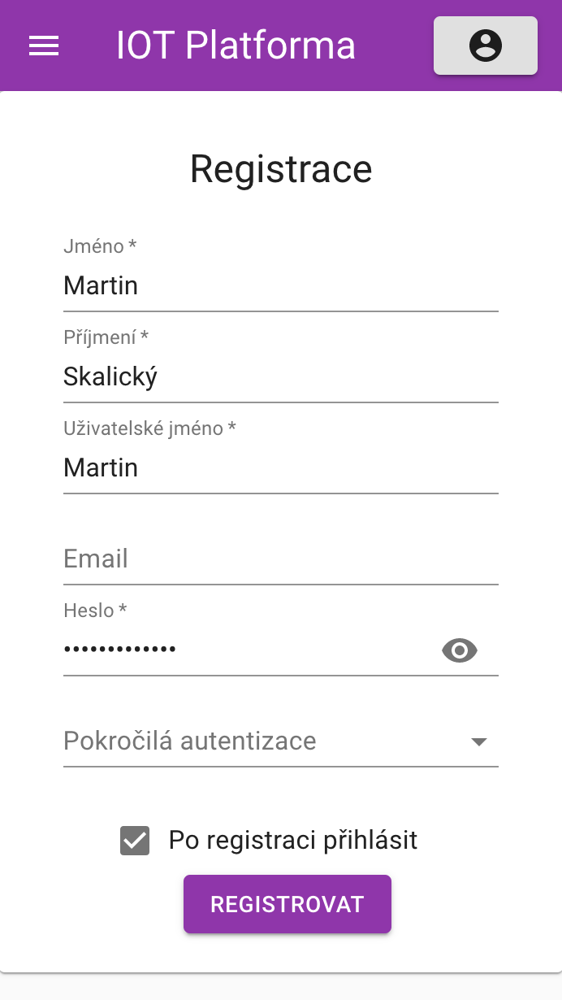
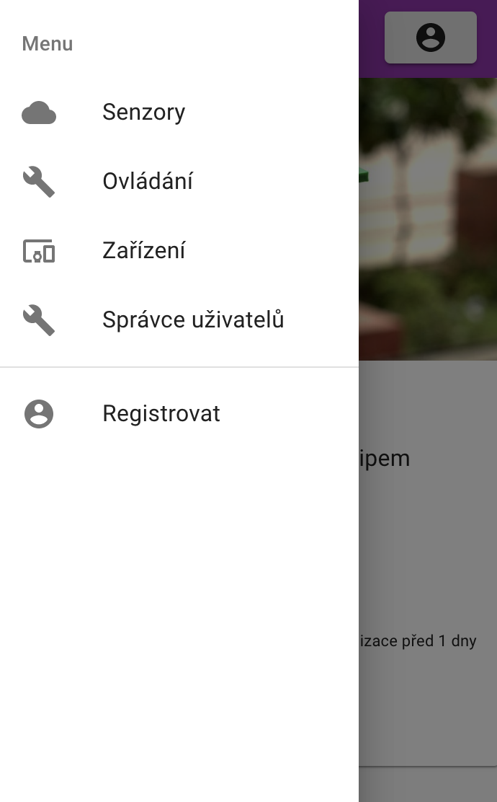

# IOT Platforma

Projekt vznikl ve volném času za účelem vytvořit alternativní IOT platformu pro co největší množství zařízení. Platforma má moderní webové rozhraní s uživatelskými účty, formuláře pro tvorbu zařízení a jejich editaci. Dále jsou implementována oprávnění - uživatelé patří do skupin [uživatel, admin] a jejich oprávnění jdou limitovat na jednotlivá zařízení, kde u každého se rozlišují:
* čtení - možnost zobrazení aktuálních dat ze senzorů a historických údajů
* ovládání - možnost ovládat dané zařízení
* zápis - možnost editace zařízení včetně oprávnění

# Ukázka rozhraní
## Úvodní stránka
Zobrazuje zařízení, které odesílají naměřená data.  

## Ovládání
Zobrazuje ovládací prvky, se kterými je možné interagovat. V pravém hoorním rohu, barevná tečka představuje stavový indikátor - červená neaktivní, zelená aktivní a oranžová čeká na potvrzení změny.  

## Přehled zařízení
Zde jsou zobrazeny všechny zařízení, které jste jako uživatel vytvořil a na která máte práva pro zápis.  

## Registrace
Formulář pro registraci uživatele.  

## Menu

# Administrátorské rozhraní
## Administrace uživatelů
V tabulce jsou všichni registrovaní uživatelé. Je možnost editace a jejich odstranení.  
